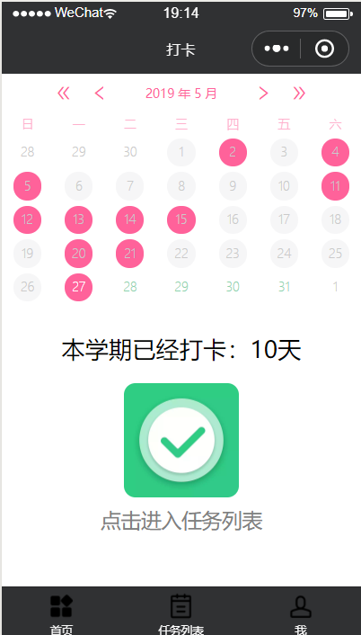
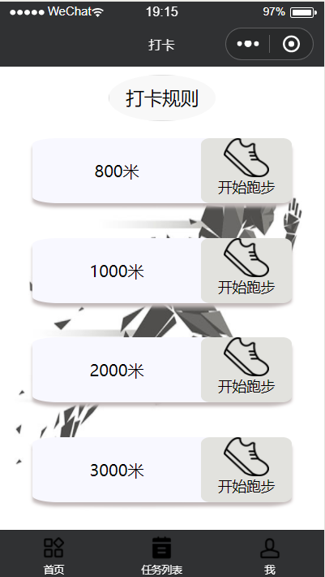
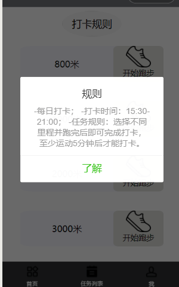
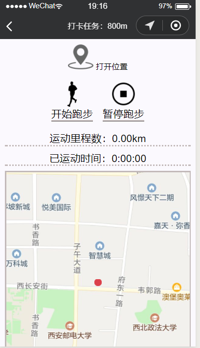

# 运动打卡小程序

基于小程序的体育打卡。

## 功能：

基于打卡机的机制，在小程序上获取位置信息并在map上画出跑步轨迹以及计算运动时间及运动距离，在运动距离和运动总时长都达到一定的要求时方能打卡成功。地图功能以及日历功能皆改自github上大佬得代码，记不太清源项目地址，有机会可以去找寻再观摩一下。

## 预览：

## 基本介绍

分三部分：

1."主页"：首先login绑定微信号openid和学号姓名，如果绑定过则直接显示首页具体页面。

2."任务列表"：然后在任务列表选择要跑步的里程数并进入计数页面记录里程和时间，只有达到对应的时间和里程数时方可打卡成功。（最短时间和最长时间都有限制，有待改进~）。打卡记录可保存在云开发或者后端服务器上的数据库中。最后可根据打卡记录评出对应的体育得分。

3."我"：可以查看一些问题帮助和小程序的信息，可以修改绑定的信息，信息存储是微信号作为主键，可修改学号姓名，保证打卡记录的存储

## 改进

1.分学期记录打卡的次数。  
2.时间范围的限制，怎么判断是否在运动。比如点击开始后坐车出门，里程够了，再等一段时间，时间也够了，照样可以打卡。  
3.最后计分时不能修改微信号绑定的学号，或者需要对微信号查重，防止多人使用同一个微信号的打卡记录得分。  